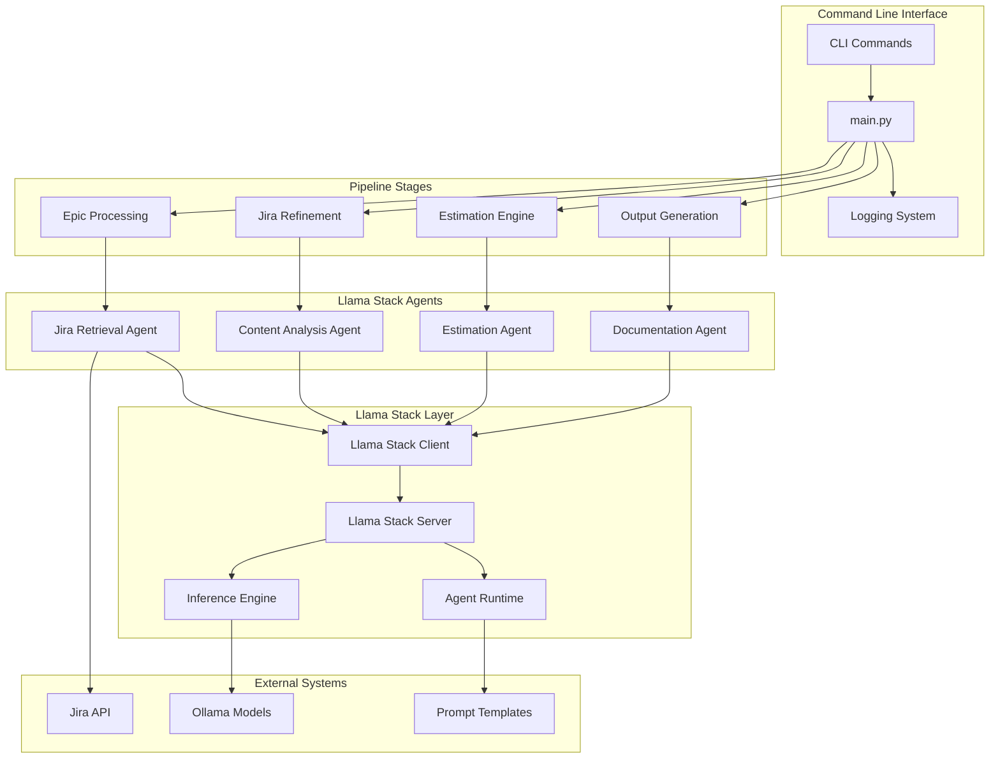
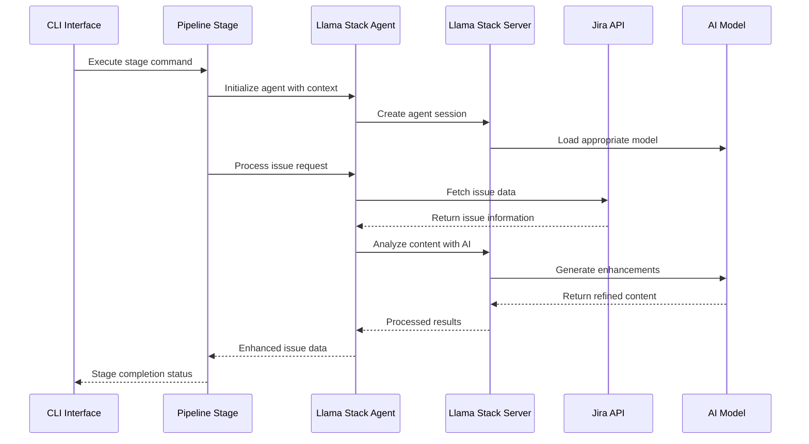

# System Architecture Overview

This document provides a high-level overview of the RHOAI AI Feature Sizing system architecture, built on [Llama Stack](https://llama-stack.readthedocs.io/en/latest/) with a comprehensive Jira refinement pipeline.

## 🏗️ Architecture Overview

The RHOAI AI Feature Sizing system is designed as a modular, AI-powered feature estimation platform with a full Jira integration pipeline that leverages Llama Stack agents for intelligent issue processing and refinement.

## 🧩 Core Components

### 1. Command Line Interface Layer

#### Main CLI Application (`main.py`)
- Unified command-line interface for all pipeline operations
- Stage orchestration and execution management
- Configuration management and validation
- Comprehensive logging and error handling

#### Available Commands
- `refine-issue` - Process individual Jira issues
- `process-epic` - Decompose epics into stories
- `estimate-batch` - Batch estimation of issues
- `run-pipeline` - Full end-to-end pipeline execution
- `configure` - System configuration management

### 2. Pipeline Stages

#### Epic Processing Stage (`stages/epics.py`)
- **Epic Analysis** - Understand epic scope and objectives
- **Story Decomposition** - Break epics into manageable user stories
- **Template Generation** - Create story templates with AI assistance
- **Dependency Mapping** - Identify inter-story dependencies

#### Jira Issue Refinement Stage (`stages/jiras.py`)
- **Issue Retrieval** - Fetch issues using Llama Stack agents
- **Content Enhancement** - Improve descriptions and acceptance criteria
- **Technical Requirements** - Add implementation details
- **Quality Validation** - Ensure completeness and clarity

#### Estimation Engine Stage (`stages/estimates.py`)
- **Complexity Analysis** - Evaluate technical and business complexity
- **Story Point Assignment** - AI-driven estimation with confidence levels
- **Risk Assessment** - Identify potential implementation risks
- **Historical Calibration** - Learn from past estimation accuracy

#### Output Generation Stage (`stages/draft_jiras.py`)
- **Refined Ticket Creation** - Generate enhanced Jira tickets
- **Estimation Reports** - Comprehensive estimation documentation
- **Export Formats** - JSON, CSV, and custom format support
- **Integration Outputs** - Formatted data for external systems

### 3. Llama Stack Agent Integration

The system leverages specialized Llama Stack agents for different aspects of issue processing:

#### Jira Retrieval Agent
- **Intelligent API Integration** - Smart Jira API querying
- **Issue Filtering** - Context-aware issue selection
- **Metadata Extraction** - Comprehensive issue data gathering
- **Batch Processing** - Efficient bulk issue retrieval

#### Content Analysis Agent
- **Natural Language Understanding** - Deep content comprehension
- **Context Extraction** - Identify key requirements and constraints
- **Gap Analysis** - Find missing information in issue descriptions
- **Enhancement Suggestions** - Recommend content improvements

#### Estimation Agent
- **Complexity Modeling** - Multi-dimensional complexity assessment
- **Pattern Recognition** - Learn from historical estimation data
- **Confidence Calculation** - Provide estimation reliability metrics
- **Calibration Feedback** - Continuous improvement of estimation accuracy

#### Documentation Agent
- **Template Application** - Apply consistent documentation formats
- **Content Generation** - Create comprehensive issue documentation
- **Cross-Reference Management** - Maintain links between related issues
- **Export Coordination** - Manage multi-format output generation

## 🔄 Data Flow

### Full Pipeline Workflow

1. **Command Execution**
   - User initiates pipeline via CLI command
   - Configuration validation and setup
   - Logging initialization and stage preparation

2. **Epic Processing (Optional)**
   - Epic retrieval via Jira Retrieval Agent
   - Epic analysis and story decomposition
   - Story template generation with AI assistance

3. **Issue Refinement**
   - Issue retrieval using intelligent agents
   - Content analysis and enhancement
   - Technical requirement addition
   - Quality validation and completion checks

4. **Estimation Processing**
   - Complexity analysis across multiple dimensions
   - AI-powered story point estimation
   - Confidence level calculation
   - Risk factor identification and documentation

5. **Output Generation**
   - Refined ticket creation with enhanced content
   - Comprehensive estimation reports
   - Multi-format export (JSON, CSV, Jira-ready)
   - Integration data preparation

### Agent Interaction Flow

## 🔧 Technology Stack

### Core Technologies
- **Python 3.12+** - Primary development language
- **Llama Stack** - AI inference and agent framework
- **Fire** - Command-line interface generation
- **uv** - Dependency management

### AI/ML Components
- **Llama Models** - Various Llama model variants for different tasks
- **Ollama** - Local model serving and management
- **Agent Runtime** - Llama Stack agent execution environment
- **Prompt Templates** - Structured AI interaction patterns

### External Integrations
- **Jira REST API** - Issue retrieval and management
- **Llama Stack Agents** - Intelligent API interactions
- **Structured Logging** - Comprehensive operation tracking

## 🏛️ Pipeline Architecture Patterns

### Stage-Based Processing
Each pipeline stage follows a consistent pattern:
- **Input Validation** - Ensure data quality and completeness
- **Agent Initialization** - Set up appropriate Llama Stack agents
- **Processing Logic** - Execute stage-specific operations
- **Output Generation** - Produce structured results
- **Error Handling** - Graceful failure management
- **Logging Integration** - Comprehensive operation tracking

### Agent Orchestration
Llama Stack agents are coordinated through:
- **Session Management** - Efficient agent lifecycle handling
- **Context Sharing** - Information flow between agents
- **Result Aggregation** - Combine outputs from multiple agents
- **Error Recovery** - Handle agent failures gracefully

### Configuration Management
- **Hierarchical Configuration** - Environment-specific settings
- **Dynamic Reconfiguration** - Runtime configuration updates
- **Validation Framework** - Ensure configuration correctness
- **Secret Management** - Secure credential handling

## 📊 Logging and Monitoring

### Comprehensive Logging System
- **Structured Logging** - JSON-formatted log entries
- **Stage Tracking** - Detailed pipeline stage execution
- **Agent Monitoring** - Llama Stack agent performance tracking
- **Error Aggregation** - Centralized error collection and analysis

### Performance Metrics
- **Pipeline Execution Time** - End-to-end processing duration
- **Stage Performance** - Individual stage execution metrics
- **Agent Efficiency** - AI agent response times and accuracy
- **Resource Utilization** - Memory and CPU usage tracking

### Monitoring Integration
- **Health Checks** - System component status monitoring
- **Performance Dashboards** - Real-time pipeline metrics
- **Alert Management** - Proactive issue notification
- **Audit Trails** - Complete operation history

## 🔒 Security Considerations

### Authentication & Authorization
- **Jira API Security** - Secure credential management
- **Agent Access Control** - Restricted agent capabilities
- **Configuration Security** - Protected configuration data
- **Audit Logging** - Complete access tracking

### Data Privacy
- **Issue Content Security** - Protect sensitive issue information
- **Local Processing** - Minimize external data exposure
- **Secure Storage** - Encrypted local data storage
- **Data Retention** - Configurable data lifecycle management

## 📈 Scalability & Performance

### Horizontal Scaling
- **Stage Parallelization** - Concurrent stage execution
- **Batch Processing** - Efficient bulk operations
- **Agent Load Balancing** - Distribute agent workload
- **Resource Optimization** - Dynamic resource allocation

### Performance Optimization
- **Caching Strategies** - Reduce redundant API calls
- **Lazy Loading** - On-demand resource initialization
- **Connection Pooling** - Efficient external API usage
- **Memory Management** - Optimized data structure usage

## 🔄 Future Architecture Enhancements

### Planned Improvements
- **Multi-Project Support** - Cross-project issue processing
- **Advanced Analytics** - Historical trend analysis
- **Real-Time Processing** - Live issue monitoring and refinement
- **Integration Ecosystem** - Additional tool integrations

### Extensibility Framework
- **Plugin Architecture** - Custom stage and agent development
- **Custom Prompt System** - Tailored AI interaction patterns
- **Integration APIs** - External system connectivity
- **Workflow Customization** - Configurable pipeline flows

---

For more detailed technical information, see:
- [Pipeline Configuration](../development/pipeline-configuration.md) - Stage configuration and customization
- [CLI Reference](../user-guide/cli-reference.md) - Command-line interface documentation
- [Agent Development](../development/agent-development.md) - Custom agent creation

*This architecture supports the full Jira refinement pipeline while maintaining compatibility with the [Llama Stack ecosystem](https://llama-stack.readthedocs.io/en/latest/) and providing extensive customization options.*
