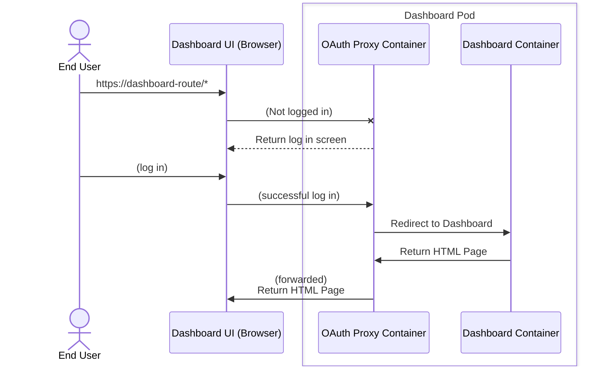
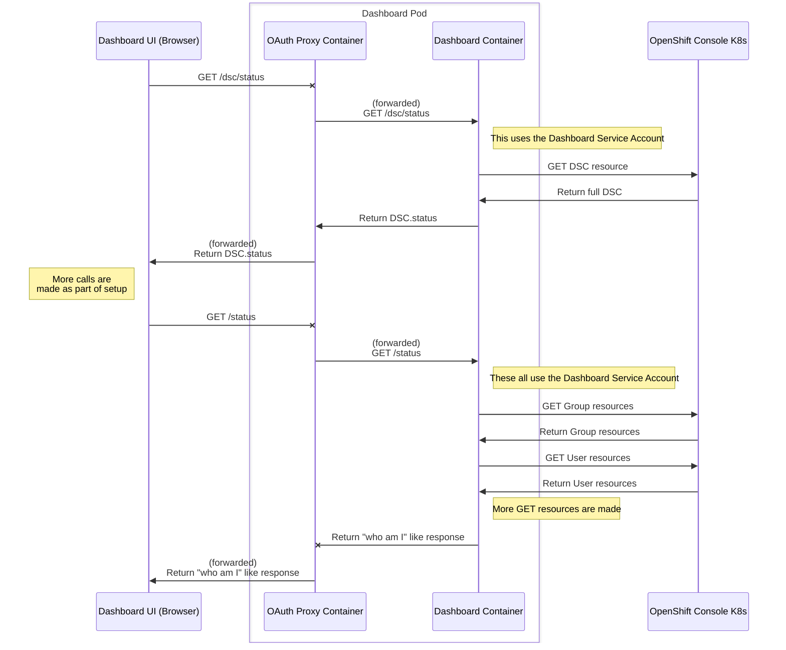
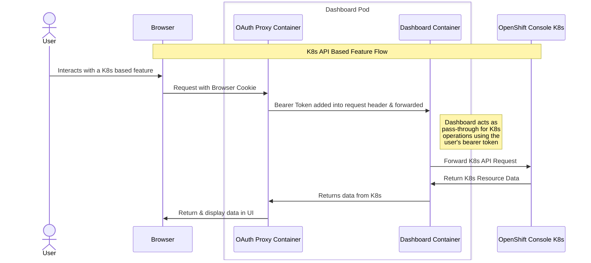
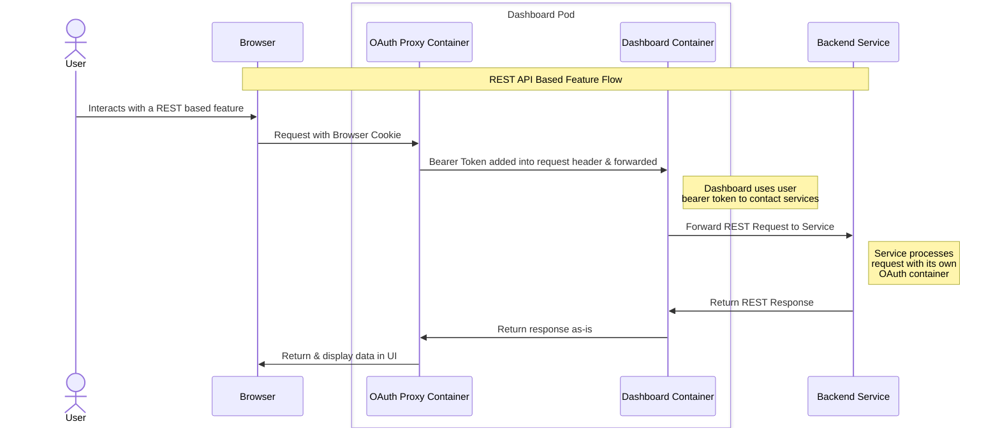
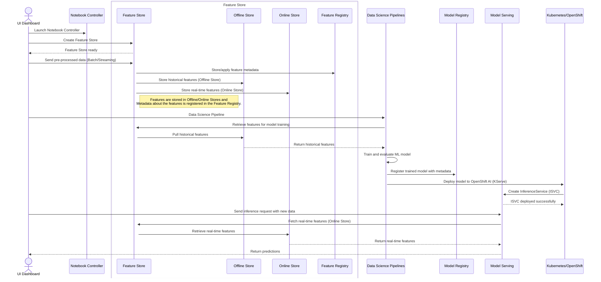
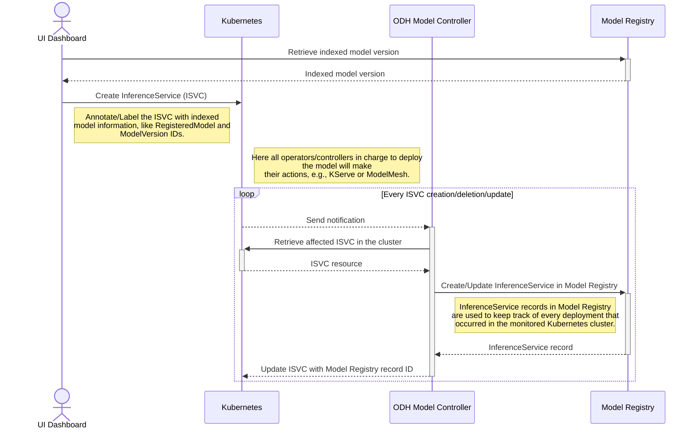

# Task: Create RHOAI Feature Refinement Document

## Objective
Fetch Jira issue {{issue_key}} and create a comprehensive RHOAI feature refinement document following the provided template and examples.

## Step-by-Step Process
1. **Fetch Complete Issue Details**: Use the Jira tools to get comprehensive information about {{issue_key}}:
   - Summary and description
   - Components and labels  
   - Priority and status
   - Reporter and assignee information
   - Any linked issues or epics
   - Comments and attachments (if relevant)

2. **Analyze and Transform**: Convert the Jira content into a structured refinement document; use the component descriptions to refine tasks and assign to the appropriate component team.

3. **Generate Complete Document**: Create the full refinement document using the template structure below

## Examples

Here are examples of well-written RHOAI refinement documents:

### Example 1: Data Science Pipeline Integration

```markdown
# RHOAI Feature Refinement - Data Science Pipeline Integration

| RHOAI Feature Refinement |  |  |  |
| :---- | :---- | :---- | :---- |
| [RHOAI-456] Feature Summary: *Integrate Kubeflow Pipelines with RHOAI data science projects* Feature Owner/PM: *Sarah Chen* Delivery Owner: *Mike Rodriguez* RFE Council Reviewer: *Alex Thompson*  | **Refinement Status** | Generated |  |
|  | **Slack channel or thread for discussions** | #forum-openshift-ai-pipelines |  |
|  | **Date created** | 2024-03-15 |  |

# **Feature Overview**

Enable data scientists to create, manage, and execute ML pipelines directly within RHOAI workbenches. Users can design pipelines using a visual interface, version control pipeline definitions, and monitor execution across the OpenShift cluster. This bridges the gap between experimentation and production deployment.

## **The Why**

Current data scientists must manually orchestrate ML workflows, leading to inconsistent deployments and difficulty scaling models to production. This feature will reduce time-to-production by 60% and ensure reproducible ML workflows, making RHOAI competitive with Databricks and AWS SageMaker.

## **High level requirements**

1. Visual pipeline designer integrated into RHOAI dashboard
2. Pipeline versioning and Git integration
3. Automated model deployment from pipeline outputs
4. Resource scheduling and optimization for pipeline steps
5. Pipeline monitoring and alerting

## **Non-functional requirements**

* **Performance parameters**: Support 100+ concurrent pipeline executions
* **Security concerns**: Pipeline isolation, RBAC integration with OpenShift
* **Disconnected needs**: Offline pipeline execution capability
* **User expectations**: Sub-5 minute pipeline startup time

## **Out of scope**

- Custom pipeline step authoring (use existing containers only)
- Integration with external orchestration tools (Airflow, etc.)
- Real-time streaming pipelines

## **Feature level Dependencies**

- Kubeflow Pipelines upstream integration
- OpenShift Service Mesh for pipeline networking
- RHOAI Model Registry for artifact management

### **Will this feature require bringing in new upstream projects or sub-projects into the product?**

Yes - Kubeflow Pipelines v2.0 SDK and Tekton integration

### **Will this feature require onboarding of a new container Image or Component?**

Yes - Pipeline execution engine containers and SDK images

### **Will this feature require user-facing documentation?**

Yes - Comprehensive documentation including tutorials and API reference

### **Will this feature require UX design?**

Yes - Visual pipeline designer interface requires extensive UX work

## **Acceptance Criteria**

- Users can create pipelines with 5+ steps using visual interface
- Pipeline execution logs are accessible within RHOAI dashboard
- Failed pipelines provide clear error messages and retry mechanisms
- Pipeline artifacts integrate with RHOAI Model Registry
- Performance meets SLA: 95% of pipelines complete within expected timeframes

## **High Level Delivery Plan**

| Team | Sprint Start Availability | Work to Deliver | Dependencies | T-Shirt Size | Comments |
| ----- | ----- | ----- | ----- | ----- | ----- |
| **Platform (Required)** | Sprint 24.2 | Kubeflow integration, cluster config | Upstream approval | L | Platform impact assessment complete |
| **Dashboard Team** | Sprint 24.3 | Visual pipeline designer UI | UX designs | M | Requires new React components |
| **Backend Team** | Sprint 24.2 | Pipeline API, execution engine | Platform work | M | REST API and database schema |
```

### Example 2: Model Serving Optimization

```markdown
# RHOAI Feature Refinement - Multi-Model Serving Optimization

| RHOAI Feature Refinement |  |  |  |
| :---- | :---- | :---- | :---- |
| [RHOAI-789] Feature Summary: *Optimize resource usage for serving multiple ML models* Feature Owner/PM: *David Kim* Delivery Owner: *Lisa Wang* RFE Council Reviewer: *TBD*  | **Refinement Status** | Generated |  |
|  | **Slack channel or thread for discussions** | #forum-openshift-ai-serving |  |
|  | **Date created** | 2024-03-20 |  |

# **Feature Overview**

Enable efficient resource sharing when serving multiple ML models by implementing dynamic batching, model caching, and intelligent resource allocation. Users can deploy multiple models on shared infrastructure with automatic scaling based on demand.

## **The Why**

Current model serving requires dedicated resources per model, leading to 70% resource waste and high infrastructure costs. This optimization will reduce serving costs by 50% while improving response times through intelligent batching and caching.

## **High level requirements**

1. Dynamic request batching across multiple models
2. Intelligent model caching with LRU eviction
3. Automatic resource scaling based on model demand
4. Request routing optimization
5. Cost and performance monitoring dashboard

## **Non-functional requirements**

* **Performance parameters**: <100ms latency increase with batching
* **Security concerns**: Model isolation, secure multi-tenancy
* **Disconnected needs**: Works with edge deployments
* **User expectations**: Zero-downtime model updates

## **Out of scope**

- Cross-cloud model serving
- Custom inference frameworks beyond supported ones
- Real-time model retraining

## **Feature level Dependencies**

- KServe optimization APIs
- Prometheus metrics integration
- OpenShift resource quotas

### **Will this feature require bringing in new upstream projects or sub-projects into the product?**

No - uses existing KServe and Istio components

### **Will this feature require onboarding of a new container Image or Component?**

Yes - Optimized serving runtime containers

### **Will this feature require user-facing documentation?**

Yes - Configuration guides and best practices documentation

### **Will this feature require UX design?**

Yes - Resource utilization dashboard requires UX design

## **Acceptance Criteria**

- Multiple models can share resources with <10% performance degradation
- Resource utilization improves by 40% compared to dedicated serving
- Dashboard shows real-time resource usage and cost metrics
- Model updates complete without request failures
- Automatic scaling responds to load changes within 30 seconds

## **High Level Delivery Plan**

| Team | Sprint Start Availability | Work to Deliver | Dependencies | T-Shirt Size | Comments |
| ----- | ----- | ----- | ----- | ----- | ----- |
| **Platform (Required)** | Sprint 24.1 | Resource optimization, KServe config | None | S | Minimal platform changes |
| **Serving Team** | Sprint 24.1 | Batching logic, caching implementation | Platform work | M | Core optimization algorithms |
| **Dashboard Team** | Sprint 24.2 | Monitoring dashboard | UX designs, backend APIs | S | Extend existing dashboards |
```

## Template Structure

Now create a refinement document for {{issue_key}} following this exact structure:

```markdown
# RHOAI Feature Refinement - [FEATURE NAME]

| RHOAI Feature Refinement |  |  |  |
| :---- | :---- | :---- | :---- |
| [{{issue_key}}] Feature Summary: *[Brief summary from Jira]* Feature Owner/PM: *TBD* Delivery Owner: *TBD* RFE Council Reviewer: *TBD*  | **Refinement Status** | Generated |  |
|  | **Slack channel or thread for discussions** | #forum-openshift-ai-[feature-name] |  |
|  | **Date created** | [Current Date] |  |

# **Feature Overview**

[Clear description based on Jira issue. Who benefits? What's the user narrative? What's the difference between today and future state?]

## **The Why**

[Business justification from Jira context. Why now? Customer impact? Competitive advantage?]

## **High level requirements**

[List functionality by business value priority. Only mandatory items for initial release.]

## **Non-functional requirements**

* **Performance parameters**: [Specific metrics and targets]
* **Security concerns**: [Security requirements and considerations]
* **Disconnected needs**: [Offline/air-gapped requirements]
* **User expectations**: [UX and performance expectations]

## **Out of scope**

[Explicitly list what's NOT included for clarity]

## **Feature level Dependencies**

[Internal and external dependencies from Jira analysis]

### **Will this feature require bringing in new upstream projects or sub-projects into the product?**

[Yes/No with specifics]

### **Will this feature require onboarding of a new container Image or Component?**

[Yes/No - note RHOAIENG tickets if needed]

### **Will this feature require user-facing documentation?**

[Yes/No - specify type]

### **Will this feature require UX design?**

[Yes/No - note UXD component if needed]

## **Acceptance Criteria**

[Specific, measurable success criteria]

## **High Level Delivery Plan**

[Based on components and scope from Jira]

| Team | Sprint Start Availability | Work to Deliver | Dependencies | T-Shirt Size | Comments |
| ----- | ----- | ----- | ----- | ----- | ----- |
| **Platform (Required)** | TBD | TBD | TBD | TBD | Platform impact assessment needed |
| [Other teams based on Jira analysis] | TBD | TBD | TBD | TBD | TBD |
```
## Componet Descriptions

## Component: Dashboard

> These docs are best viewed in Dark Mode. Improvements for Light Mode are coming soon.

The Dashboard is the primary UI provided for OpenShift AI. The Dashboard serves as a [thin-layer of UI](#the-thin-wrapped-layer) functionality to interact with the flows provided through OpenShift AI. 

* [Architecture](#architecture)
    * [Overview](#overview)
    * [Feature Types](#feature-types)
    * [The Thin Wrapped Layer](#the-thin-wrapped-layer)
* [Configuring & Interacting with the Dashboard](#configuring--interacting-with-the-dashboard)
    * [Dashboard Feature Details](#dashboard-feature-details)
* [How Dashboard Stores Data](#how-dashboard-stores-data)
* [User Access - Permissions](#user-access---permissions)
* [Supported Components](#supported-components)
* [Projects - OpenShift vs Data Science Differences](#projects---openshift-console-vs-data-science-differences)
* [Dashboard Custom Resource Definitions (CRDs)](#dashboard-custom-resource-definitions-crds)

### Architecture

#### Overview

##### 1. User Authentication Flow and UI Initialization

This section illustrates how an end user interacts with the Dashboard UI and the OAuth Proxy for authentication. The OAuth Proxy is a sidecar pattern inside the dashboards pod in OpenShift. It ensures that all traffic has a valid token, and that subsequent requests are authenticated. 



##### 2. Data Fetching and Integration
The Dashboard retrieves infrastructure data by interacting with the OpenShift Console Kubernetes API.




##### Key takeaways:

* OAuth Proxy does our login screen -- Dashboard does *not* have one, all requests go through the Oauth Proxy
* Every request cross the OAuth Proxy line on the way to getting data, and thus is authenticated through that mechanism per request (using bearer tokens on each request)
* Our backend serves as a pass-through to get additional information from K8s (OpenShift Console) 
* There are multiple startup calls for various information, see the rest of the doc for more detailed information. 

#### Feature Types

This section describes at a high level how feature connectivity works. For specific details on features, see the [Dashboard Feature Details](#dashboard-feature-details) section.

There are a couple ways features work today, through a k8s direct backend or a REST based OpenShift AI component backend.

##### K8s API Based Feature

K8s API based features are things that make use of custom resources (aka CRs, backed by CRDs) or K8s resources. These are features that have likely a controller managing the resources and/or it makes use of other K8s based resource concepts. Security is provided by K8s RBAC.



Features that use this model are (some examples):
* DS Projects
* Workbenches
* Model Serving
* etc...

##### REST API Based Feature

Rest API based features are features that rely on a custom REST endpoint usually shared via an internal `Service` (or an external `Route` object) provided by the backend component. These services (and sometimes external routes) are usually created by a custom resource that is deployed in the Data Science Project. Security is provided by OAuth Containers.



Features that use this model are (some examples):
* Model Registry
* DS Pipelines
* etc...

#### The Thin Wrapped Layer

The Dashboard does not watch resources, so it does not manage the lifecycle of them (not even CRD variants we own). We simply CRUD data at runtime (when the user reaches a page or the backend node instance/pod starts up).

All functionality to do something complex is driven by backend components and not something the Dashboard ever owns. From a stack perspective, Dashboard is not required to use our API / features and thus cannot be the glue to make it happen.

### Configuring & Interacting with the Dashboard

The Dashboard does not expose direct API, rest or otherwise. Our Pod HTTPS endpoints are a Tier 4 API system (not for external consumption), and thus not intended for anyone to use other than our frontend UI client.

However, the dashboard has some ways to configure it and how we will store information the user does internally, which most of the time can be configured externally if desired.

Read more about the specifics in [Configuring the Dashboard](./configuringDashboard.md)

#### Dashboard Feature Details

Most features in the Dashboard are documented by other component's documentation. However, there are details about connectivity & specific Dashboard feature that are documented in the [Features](./features/README.md) section.

### How Dashboard Stores Data

The Dashboard does not contain a self-storage (eg. DBs, in-memory caches[1], etc). We use K8s resources for storage for all things shared between users. We also use some browser storage to maintain user preferences.

> [1] Note: The dashboard has a 2-min in-memory cache of some resources to help with performance; these are copies of on-cluster resources and not unique storages.

Read more details about our storage mechanisms in [Dashboard Storage Mechanisms](./dashboardStorage.md)

### User Access - Permissions

Conceptually, the Dashboard uses the user's RBAC permissions granted directly on K8s to control the flow of what they can do and how to do it. We make use of SelfSubjectAccessReview (SSAR) checks to determine if a user can successfully perform an action before we render UI. This helps us show a dynamic UI based on what the user has access to.

Our API layers are to make use of the OAuth Proxy's user token and just pass that through to the K8s or REST endpoints. Effectively making the call on behalf of the user.

There are a few exceptions that are mostly deprecated and have a desire to be removed:

* Jupyter tile
    * Users do not have direct access to the namespace where Notebook resources are deployed, and thus do not have K8s RBAC access
    * The Dashboard Service Account manages their resources
    * **Future Goal:** Restructure the way Jupyter tile manages the data in such a fashion the user can have proper permissions over their resources
* Some base infrastructure 
    * Understanding installed stack components (Platform)
        * **Future Goal:** Currently no plans to shift away from the Service Account
    * Retrieving infrastructure based files from the deployment namespace
        * **Future Goal:** Convert to read-only for users to understand static items (much like `ImageStreams` are today for Workbench images)
    * Understanding user permissions
        * **Future Goal:** Likely required to stay on the Service Account, but infrastructure may be able to change so its less Admin vs User and "what you have access to"
    * The Dashboard Service Account manages getting the needed information to validate and operate on these functionalities
* [Admin access](#admins) (aka "Settings" navigation)
    * All UI admin functionality is done by the Service Account despite the user maybe having valid permissions to do so
    * **Future Goal:** Empower those picked as Admins to have direct permissions & shift to a SSAR model for Admin views

#### Fundamental User Types

**Note:** This is not a section to discuss user personas. This is the technical understanding on how users will be impacted and will consume data from the API in the UI.

There are fundamentally 3 types of users to understand.

1. Cluster Admins (`cluster-admin` role granted at the cluster level)
   * Cluster admins on the OpenShift Cluster are read in as Product admins to the Dashboard
   * They also have _all_ k8s permissions one can have
   * It is expected that this type of user is extremely small in number due to the implicit security concerns it would mean to the cluster's cluster
   * This is a k8s concept ([external docs](https://kubernetes.io/docs/reference/access-authn-authz/rbac/#user-facing-roles))
2. Product Admins
   * Product admins, aka RHOAI Admins, are admins of the product who see `Settings` and who will be responsible for configuring the way Dashboard features work
   * All functionality they have is done through our Service Account
   * More information can be found in the [admins](#admins) section
3. **Project** users
   * aka just users with a project
   * Without a project, these users are as basic as they come -- they should have no access to anything and permissions do anything
   * This role concept can be combined with Product Admins today; combining it with Cluster Admins is expected to do nothing additional
   * There are 3 variants to this:
     1. **Admin**; can change permissions (invite/remove people from the project) & modify the name/description of the project
     2. **Contributor** (aka Edit); Can do everything but what is explicitly noted for Admins 
     3. **View**; We do not support this state -- but effectively they can change nothing and also cannot see secrets (Connections)

**Note:** Self provisioning role is not covered in the list above -- assume this is separate of content in this section.

#### Admins

Admins today are determined by being in one of these groups:

* The OdhDashboardConfig resource has a field for "admin_groups"; any valid OpenShift Group resource listed here is considered an admin group -- any users within should see the Settings navigation
* The `cluster-admin` Role is granted in a RoleBinding to the user

Note: Any other ways today, including comprehensive Role bindings or the initial kube:admin user do not inherently get the definition of an admin.

Note: You can add `cluster-admin` role to the user or add them to an existing admin group to grant them access. Kube-admin specifically can be referenced by `b64:kube:admin` in the users of a Group.

### Supported Components

The Dashboard supports the stack with UI components. Each backend functionality can expose in multiple different ways in the Dashboard. Such as an admin-only configuration, a top-level navigation, or a sub-section of another component.

Current supported OpenShift AI components are:

- Workbenches
- Data Science Pipelines
- Model Serving
- Platform
- Distributed Workloads
- Model Registry (soon)

Concepts not provided by OpenShift AI that are supported are:

- OpenShift Projects ([these overlap with Data Science Projects](#projects---openshift-console-vs-data-science-differences))
- K8s PersistentVolumeClaims (aka PVCs or Cluster Storage)
- Various K8s Secrets & Configmaps in different fashions 

### Projects - OpenShift Console vs Data Science Differences

Short answer: **There is no difference**. All projects the user has access to is viable for OpenShift AI flows and thus can be a "Data Science Project".

More details:

* Initially there was an intent to have Projects created by the Dashboard to have specific flows to provide to users; this since has become a point of confusion and frustration trying to extend existing Projects
* Projects created in the Dashboard have a `opendatahub.io/dashboard` label to indicate they are Dashboard Data Science Projects
* Some namespaces are ignored despite permissions, these are namespaces that are not intended for data science flows (infrastructure namespaces, configuration namespaces, etc)
* Most resources within projects have the `opendatahub.io/dashboard` label to help indicate their intent for Data Science flows
    * Note: There is a goal to reduce this to pure K8s resources and all AI custom resources (Notebook, ServingRuntimes, InferenceServices, etc) should not need the label 

> Note: You can read more about `opendatahub.io/dashboard` in [Dashboard K8s Labels & Annotations](./k8sLabelsAndAnnotations.md#opendatahubiodashboard)

### Dashboard Custom Resource Definitions (CRDs)

A CRD is a definition of a resource that extends the K8s library of resources. Each Dashboard CRD has a purpose that can be extended by other components or by the customers if they wish to contribute items.

#### OdhDashboardConfig (singleton)

**odhdashboardconfigs.opendatahub.io/v1alpha**

> **Note:** This resource is partially configurable with in-app Admin flows

This resource should only ever be created once in the same namespace the Dashboard is deployed. This resource is auto created by the Dashboard on initialization or by the Operator part of deploying the RHOAI Dashboard.

This resource configures the feature flags, details about the Jupyter tile, user groups, and notebook/serving size defaults.

#### OdhApplication

**odhapplications.dashboard.opendatahub.io/v1**

These are resources that provide a tile to the Applications (Enabled/Explore pages). These resources can have OdhDocument & OdhQuickStart references.

The Jupyter tile is one of these resources that we specifically read in values of to render the tile.

#### OdhDocument

**odhdocuments.dashboard.opendatahub.io/v1**

These resources provide access to link to external documentation about how-tos and other types. These resources appear in the resources section.

#### OdhQuickStart

**odhquickstarts.console.openshift.io/v1**

These resources provide access to have embedded quick starts, where the users can access the quick start and follow a guided experience.

#### AcceleratorProfiles

**acceleratorprofiles.dashboard.opendatahub.io/v1**

> **Note:** This resource is fully configurable with in-app Admin flows

These resources help provide information of your accelerators on your cluster and gives the admin the ability to configure or disable them as they see fit. In turn, the user can get access to "profiles" of how

#### HardwareProfiles

**hardwareprofiles.dashboard.opendatahub.io/v1alpha1**

> **Note:** This resource is fully configurable with in-app Admin flows

The HardwareProfiles CRD provides a declarative way for administrators to define compute profiles that control the CPU, memory, and other resource constraints available for workloads in OpenShift AI. These profiles are surfaced to end users to select when launching workloads such as Workbenches.

Admins can configure profiles directly within the Dashboard, enabling or disabling profiles, as well as setting minimums, maximums, and default values for CPU, memory, and other resources (e.g., GPUs).

## Componenet: Model Explainability Architecture

 *diagram is here: https://github.com/opendatahub-io/architecture-decision-records/blob/main/documentation/components/explainability/diagram.png*

The TrustyAI operator[^operator] is responsible for managing the lifecycle of `TrustyAIService` (TAS) Custom Resources (CR).

## Component: `TrustyAIService`

TrustyAI is designed to support a single `TrustyAIService` per namespace/project. Although multiple TASs can be created in the same namespace, and indeed work, due to the architecture this will not bring any additional benefit, and will only duplicate the computations performed by a single TAS.

In the following sections, we will always assume a single TAS per namespace.

The general syntax of the `TrustyAIService` CR is as follows:

```yaml
apiVersion: trustyai.opendatahub.io/v1alpha1
kind: TrustyAIService
metadata:
  name: trustyai-service
spec:
  storage:
    format: "PVC"
    folder: "/inputs"
    size: "1Gi"
  data:
    filename: "data.csv"
    format: "CSV"
  metrics:
    schedule: "5s"
```

- `metadata.name` specifies the name of the `TrustyAIService`.
- `spec.storage.format` specifies the storage format. Currently, only `PVC` is supported.
- `spec.storage.folder` specifies the folder where the input data is stored.
- `spec.storage.size` specifies the size of the PVC to be used for storage.
- `spec.data.filename` specifies the suffix of the storage file.
- `spec.data.format` specifies the format of the data file (only `CSV` supported at the moment).
- `metrics.schedule` specifies the interval at which the metrics are calculated, when a a calculation request is register with the service.

The default behaviour when installing a CR in a namespace is for the operator to provision the following resources:

| Type                  | Name                     | Description                                        |
|-----------------------|--------------------------|----------------------------------------------------|
| Deployment            | `$(metadata.name)`       | Deploys a pod with two containers (service and OAuth). |
| PersistentVolumeClaim | `$(metadata.name)-pvc`   | Claims a volume for the storage of the inference data. |
| Service               | `$(metadata.name)-service`| Internal service to the TrustyAI REST server.     |
| Service               | `$(metadata.name)-tls`   | Service to expose the TrustyAI OAuth server.      |
| Route                 | `$(metadata.name)`       | Route exposing the `$(metadata.name)-tls`.        |

## Payload consumption

When a `InferenceService` (IS), either ModelMesh or KServe is detected by the operator in the same namespace as a `TrustyAIService`, the operator will try to configure the `InferenceService` to send the inference data to the `TrustyAIService` for processing.

### ModelMesh

When a ModelMesh IS is detected, the operator will set the `PAYLOAD_PROCESSOR` environment to the internal `$(metadata.name)-service`. `PAYLOAD_PROCESSOR` is interpreted by ModelMesh as a space-delimited list of endpoints. If additional endpoints are present, the operator will append the `$(metadata.name)-service` to the list. If the processor is already present, the operator will not modify the list.

### KServe

In the case of KServe, the operator will either add (if not present) or replace the `spec.logger` field with the internal `$(metadata.name)-service`. As example, the final[^kserveis] IS will look similar to:

```yaml
apiVersion: serving.kserve.io/v1beta1
kind: InferenceService
metadata:
  name: sklearn-iris
spec:
  predictor:
    logger: # Added by the TrustyAI operator
      mode: all
      url: http://$(metadata.name)-service.$namespace.svc.cluster
    model:
      modelFormat:
        name: sklearn
      storageUri: gs://kfserving-examples/models/sklearn/1.0/model
```

## Authentication

Each TAS will have two associated `Services`:

- `$(metadata.name)-service` (1)
- `$(metadata.name)-tls` (2)

(1) will have no route associated with it, and will be used for internal communication between the IS and the TAS. This service does not support authentication or TLS at the moment (2) will be exposed via a `Route`, supports TLS and will be used for OAuth authentication.

Request to (2) will be authenticated using a bearer token in the request header, `Authorization: Bearer <token>`. These requests will be forwarded to the OAuth container (running `oauth-proxy`[^oauth-proxy]) for authentication. If the token is valid, the request will be forwarded to the TrustyAI service container.

Requests to (1) will not be authenticated, and will be forwarded directly to the TrustyAI service container.


[^operator]: [TrustyAI Operator repository](https://github.com/trustyai-explainability/trustyai-service-operator).
[^kserveis]: Example IS taken from [KServe's documentation](https://kserve.github.io/website/0.11/modelserving/logger/logger/#create-message-dumper).
[^oauth-proxy]: [OAuth Proxy repository](https://github.com/openshift/oauth-proxy)

## Component: Feature Store

### Feast Feature Store Architecture

<!-- sources:
https://docs.feast.dev/
https://rtd.feast.dev/
-->

#### Introduction

Feast (Feature Store) is an open-source feature store that helps teams operate production ML systems at scale by allowing them to define, manage, validate, and serve features for production AI/ML.

#### Feast Feature Store High Level Architecture

The architecture diagram presents a high level overview of OpenShift AI environment that integrates Feast for feature store, and other component like Data Science Pipelines / Notebooks for Model training, a Model Registry for using models, and Model Serving for model inference/serving. 


#### Goals

- Integrate Feast Feature Store as a centralized repository for feature management within OpenShift AI. 
- Provide a unified view of features used during model training and serving stages.


#### Components

Feast's feature store is composed of below foundational components: 
<!-- sources:
https://docs.feast.dev/getting-started/components

-->

1. [**Offline Store**](https://docs.feast.dev/getting-started/components/offline-store) : Used for historical feature extraction used in model training.
2. [**Online Store**](https://docs.feast.dev/getting-started/components/online-store): Used for serving features at low-latency for inference requests in production. 
3. [**Registry**](https://docs.feast.dev/getting-started/components/registry): Used to keep track of feature store definitions and state (optionally backed by GCS or S3 based persistent storage). The Feast Registry acts as the backbone for storing feature definitions, which are typically written in Python, stored in feature repositories, and shared across environments such as staging and production.
4. [**Feast Python SDK/CLI**](https://docs.feast.dev/reference/feast-cli-commands): The primary user facing SDK
   - Manage version controlled feature definitions.
   - Materialize (load) feature values into the online store.
   - Build and retrieve training datasets from the offline store.
   - Retrieve online features.
5. [**Batch Materialization Engine**](https://docs.feast.dev/getting-started/components/batch-materialization-engine) : A batch materialization engine is a component of Feast that's responsible for moving data from the offline store into the online store.
6. [**Feature Repository**](https://docs.feast.dev/reference/feature-repository/feature-store-yaml) : Contains Feature definitions files written in Python , and the `feature_store.yaml` file to configure the feature store, including data sources with Feast project.
7. [**Feature Server**](https://docs.feast.dev/reference/feature-servers/python-feature-server): The Feature Server is a core architectural component in Feast, designed to provide low-latency feature retrieval and updates for machine learning applications.
      It is a REST API server built using [FastAPI](https://fastapi.tiangolo.com/) and exposes a limited set of endpoints to serve features, push data, and support materialization operations. The server is scalable, flexible, and designed to work seamlessly with various deployment environments, including local setups and cloud-based systems.
8. [**Feature Store Controller/Operator**](https://github.com/feast-dev/feast/tree/master/infra/feast-operator): The Feature Store Controller/Operator is responsible for the deployment and management of the Feast servers ([Offline Server](https://docs.feast.dev/reference/feature-servers/offline-feature-server), [Online Server](https://docs.feast.dev/reference/feature-servers/python-feature-server), [Registry Server](https://github.com/feast-dev/feast/blob/master/docs/reference/feature-servers/registry-server.md)) in Kubernetes/OpenShift environments:

#### Feature Store Flow with OpenShift AI.

**1. Feature Store Initialization**
The UI Dashboard initializes/Creates the FeatureStore CR and sets the config for feature services used for data ingestion, transformation, and storage.

**2. Data Ingestion into Feature Store**
Data can be sent to Feast either pre-processed (e.g., via batch or streaming data pipelines) or raw and transformed by the Feast feature server during data ingestion (i.e., transformed prior to being written to the online store). Feast simplifies the integration with various data sources by providing an opinionated yet flexible API.

**3. Data Storage in Feature Store**

**Offline Store**: A lower-cost, persistent storage system (e.g., data warehouse) optimized for storing large volumes of historical feature data used in model training and batch scoring. It prioritizes storage efficiency over low-latency access.
**Online Store**: A higher-cost, low-latency storage system (e.g., in-memory database or cache) designed to provide rapid access to frequently used features during real-time inference, optimizing for speed and responsiveness.
**Feature Registry:** Metadata storage to track feature definitions, feature transformations, and feature metadata.

**4. Data Retrieval for Model Training**
Data Science Pipelines retrieve historical features from the Offline Store. Feature views in the Feature Registry define how features are joined and retrieved.

**5. Model Training**
The retrieved data is split into train, test, and hold-out sets. The model is iteratively trained and evaluated on these datasets.

**6. Model Evaluation**
The trained model is validated on a hold-out dataset to assess its accuracy, generalizability, and impact to its domain.
**Workflow:** Data retrieved → Train/Test split → Train Model → Evaluate Performance.

**7. Model Registration**
The trained model is registered in the Model Registry. 

**8. Model Deployment**
The registered model is deployed to the Model Server.

**9. Inference Request**
There are three ways to orchestrate inference requests. 
    1. The applications sends an inference requests to the Model Server and the Model Server retrieves real-time features from the Feature Server and generates predictions using the retrieved features and deployed model.
    2. The application sends an inference request to the Feature Server and the Feature Server sends the features to the Model Server and generates predictions using the deployed model.
    3. The application sends a request to the Feature Server and sends the features to the Model Server whcih generates predictions using the deployed model.



## Component: Model Registry

### Model Registry architecture

<!-- sources:
- "Model Registry Architecture" https://docs.google.com/document/d/1OLqy3ivdPs4Db78VrdnnGVkdPpkNPhJZAdAZkMwqUp0/edit
- "Model Registry Proposal" https://docs.google.com/document/d/1G-pjdGaS2kLELsB5kYk_D4AmH-fTfnCnJOhJ8xENjx0/edit#heading=h.ds8q4xtkmu64
-->

#### Introduction

A model registry plays a pivotal role in the lifecycle of AI/ML models, serving as the central repository holding metadata pertaining to machine learning models from inception to deployment. This encompasses both high-level details like deployment environment and project origins, as well as intricate information like training hyperparameters, performance metrics, and deployment events. Acting as a bridge between model experimentation and serving, it offers a secure, collaborative interface of a metadata store for stakeholders involved in the ML lifecycle.

#### Model Registry High Level Architecture 


> [!NOTE]  
> The Model Registry is a passive repository for metadata and is not meant to be a Control Plane. It does not perform any orchestration or expose APIs to perform actions on underlying OpenShift AI components. 

The model registry is a backing store for various stages of MLOps that can log user flow of a model development and deployment. The model registry meets a data scientist's need to be able to visualize a model’s lineage and trace back the training executions, parameters, metrics, etc. It also help deployment engineers visualize model pipeline events, actions, progress through deployment stages, etc. 

#### Goals 
- Associate metadata from training, experimentation, studies and their metrics, with a model
- Build a catalog of models and manage model versions for deployment
- Management of model for multiple deployment environments
- Build a Kube Native solution

#### Architecture

Google community project [ML-Metadata](https://github.com/google/ml-metadata) is used as the core component to build the Model Registry. ML-Metadata provides a very extensible schema that is generic, similar to a key-value store, but also allows for the creation of logical schemas that can be queried as if they were physical schemas. Those can be manipulated using their bindings in the Python library. We use this model to extend and provide metadata storage services for model serving, also known as Model Registry.

The model registry uses the ml-metadata project’s C++ server as-is to handle the storing of the metadata, while domain-specific Model Registry features are added as extensions (aka microservices). As part of these extensions, Model Registry provides:
- Python/Go extensions to support the Model Registry interaction
- an OpenAPI interface to expose the Model Registry API to the clients


Enforcing of RBAC policies can be handled at the REST API layer using service accounts with Authorino, details about [RBAC and Tenancy](model-registry-tenancy.md) are described here.

#### Components
- *[MLMD C++ Server](https://github.com/google/ml-metadata)*
  - This is the metadata server from Google's ml-metadata project.  This component is hosted to communicate with a backend relational database that stores the actual metadata about the models. This server exposes a “gRPC” interface for its clients to communicate with. This server provides a very flexible schema model, where using this model one can define logical data models to fit the needs of different MLOps operations, for example, metadata during the training and experimentation, metadata about metrics or model versioning, etc. 
  
- *[OpenAPI/REST Server](https://github.com/kubeflow/model-registry)*
  - This component exposes a higher-level REST API of the Model Registry. In contrast, the MLMD server exposes a lower level generic API over gRPC, whereas this REST server exposes a higher level API that is much closer to the domain model of Model Registry, like:
    - Register a Model
    - Version a Model
    - Get a catalog of models
    - Manage the deployment statutes of a model
  
  - The REST API server converts its requests into one or more underlying gRPC requests on the MLMD Server. This layer is mainly designed to be used with UI.

- *[Model Registry Controller](https://github.com/opendatahub-io/model-registry-operator)*
  - Model Registry controller is also called Model Registry Operator. The main purpose of this component is to install/deploy components of the Model Registry stack on the OpenShift. Once the components are installed, the reconciler in the controller will continuously run and monitor these components to keep them healthy and alive. 

- *[CLI (Python client, SDK)](https://github.com/kubeflow/model-registry/tree/main/clients/python)*
  - CLI is also called MR Python client/SDK, a command line tool for interacting with Model Registry. This tool can be used by a user to execute operations such as retrieving the registered models, get model’s deployment status, model’s version etc. 
  
  - The model registry provides logical mappings from the high level [logical model](https://github.com/kubeflow/model-registry/blob/main/docs/logical_model.md) available through the OpenAPI/REST Server, to the underlying ml-metadata entities.

#### Integration with Model Serving Components

<!-- sources:
- https://issues.redhat.com/browse/RHOAIENG-1071
- https://github.com/opendatahub-io/model-registry-bf4-kf/issues/249
- https://github.com/opendatahub-io/odh-model-controller/pull/135
-->

In a typical ML workflow, a ML model is registered on the Model Registry as a `RegisteredModel` logical entity, along with its versions and its associated `ModelArtifacts` resources.

Then, Model serving controller advertises itself to the Model Registry, by creating a `ServingEnvironment` entity.

Then, the Model Controller reconciler monitors `InferenceService` CRs having pre-defined `labels`, and based on those `labels` it syncs the model registry by keeping track of every deployment that occurred in the cluster.
Then, the Model Controller reconciler updates the `InferenceService` CR by linking it to the Model Registry logical entity using a specific `label`.



In this way, the Model Controller reconciler syncs those occurrence into the Model Registry to keep track of every deployment that occurred in the cluster for indexed models.

<!-- to be continued once finalized "Model Registry Tenancy Proposal" -->

## Component: Data Science Pipelines

### Data Science Pipelines

Data Science Pipelines is a platform for building and deploying portable, scalable machine learning (ML) workflows based on containers. It is based on Kubeflow Pipelines and relies on Argo Workflows to run the pipelines. Additionally, Data Science Pipelines includes a custom "control plane" on top of Kubeflow Pipelines -- an operator we refer to as Data Science Pipelines Operator (DSPO). DSPO manages the "data planes", the individual "Data Science Pipelines Applications" (aka "stacks") that are deployed in each Data Science Project (kubernetes namespace).

#### Data Science Pipelines Operator APIs

##### DataSciencePipelinesApplication (DSPA)

* [API Reference](https://github.com/opendatahub-io/data-science-pipelines-operator/blob/main/api/v1alpha1/dspipeline_types.go)
* This CRD is responsible for defining the configuration of the Data Science Pipelines stack.

#### DSP High Level Architecture


#### DSP Detailed Architecture


#### Kubeflow Pipelines Architecture references

Note: you must join https://groups.google.com/g/kubeflow-discuss to access these documents

[Kubeflow Pipelines v2 System Design](https://docs.google.com/document/d/1fHU29oScMEKPttDA1Th1ibImAKsFVVt2Ynr4ZME05i0/edit) -- goes into deeper detail for the data plane design. The Orchestration section in that document is particularly helpful.

[KFP v2 control flow](https://docs.google.com/document/d/1TZeZtxwPzAImIu8Jk_e-4otSx467Ckf0smNe7JbPReE/edit)

## Component: Platform

#### Platform Architecture

Platform component is responsible for maintaining the core ODH Operator and establishing standards for component 
deployments, monitoring, security and ecosystem integration.

##### ODH Operator APIs

##### DSCInitialization API

* [API Reference](https://github.com/opendatahub-io/opendatahub-operator/blob/incubation/docs/api-overview.md#dscinitializationopendatahubiov1)
* This CRD is responsible for defining config required by the ODH platform before the applications are deployed.
* This includes creation of applications and monitoring namespaces, component wide configurations like Authorization,
monitoring etc

##### DataScienceCluster API

* [API Reference](https://github.com/opendatahub-io/opendatahub-operator/blob/incubation/docs/api-overview.md#datascienceclusteropendatahubiov1)
* This CRD will be created by the end user to enable various data science components.
* It is responsible for enabling support for Notebooks, DataSciencePipelinesApplication, InferenceService etc based on 
the configuration

##### Platform Architecture Overview


##### Authorization in ServiceMesh


## Component: Model Serving

### ModelServing architecture

#### Components
- *[KSERVE](https://github.com/opendatahub-io/kserve)*
  - This supports a single model serving platform. For deploying large models such as large language models (LLMs), OpenShift AI includes a single model serving platform that is based on the KServe component. Because each model is deployed from its own model server, the single model serving platform helps you deploy, monitor, scale, and maintain large models that require increased resources.
- *[MODEL MESH](https://github.com/opendatahub-io/modelmesh-serving)*
  - This supports a multi-model serving platform. For deploying small and medium-sized models, OpenShift AI includes a multi-model serving platform that is based on the ModelMesh component. On the multi-model serving platform, you can deploy multiple models on the same model server. Each of the deployed models shares the server resources. This approach can be advantageous on OpenShift clusters that have finite compute resources or pods.
- *[ODH-MODEL-CONTROLLER](https://github.com/opendatahub-io/odh-model-controller)*
  - This component facilitates seamless integration between RHOAI's various components and model serving components, enhancing the interoperability and synergy within the RHOAI ecosystem. It streamlines the integration process, enabling smoother communication and interaction between different modules and services, thereby optimizing the overall performance and functionality of the RHOAI platform


#### ModelServing Componets Architecture Diagram 


# Workbenches architecture

<!-- sources:
- "Kubeflow Notebooks Architecture" https://www.kubeflow.org/docs/components/notebooks/overview/
- "Kubeflow Architecture" https://www.kubeflow.org/docs/started/architecture/
-->

Workbenches component provides a platform to run web-based development environments inside the openshift cluster. In the ML lifecycle, workbenches are utilize as platform in Model Development Stage. As it provides as avenue for the Data Scientist, to explore and experiment on the development of model.

Key features include:

- Native support for [JupyterLab](https://github.com/jupyterlab/jupyterlab), [RStudio](https://github.com/rstudio/rstudio), and [code-server](https://github.com/coder/code-server).
- Tailored integrated environments equipped with the latest tools and libraries.
- Users can create notebook containers directly in the cluster.
- Admins can provide standard notebook images for their organization with required packages pre-installed.
- Access control is managed by Admins, enabling easier notebook management in the organization.

Components:

- *[Notebooks/workbenches](https://github.com/opendatahub-io/notebooks/wiki/Workbenches)*
  - A collection of notebooks tailored for data analysis, machine learning, research and coding within the Openshift ecosystem. Designed to streamline data science workflows, these notebooks offer an integrated environment equipped with the latest tools and libraries. These notebooks were created to be used with Openshift with the Notebook Controller as the launcher. The following are the out of the box notebook images supported with One year cadence:
    
    - Minimal (includes: jupyterlab)
    - Data-science (includes: jupyterlab, numpy, scipy, pandas,etc)
    - PyTorch (includes: jupyterlab, torch,etc)
    - TensorFlow(includes: jupyterlab, tensorflow,etc)
    - TrustyAI (includes: jupyterlab, trustyai,etc)
  - GPU support: Nvidia (CUDA drivers), Intel (Habana-Gaudi drivers)

- *[Notebook Controller](https://github.com/opendatahub-io/kubeflow/tree/v1.7-branch/components/odh-notebook-controller)*
  - The combination of two controller which acts as the backend for this component. Based on the upstream kubeflow notebook controller and it is responsible to watch the Notebook custom resource events to start the notebook environment along with the following capabilities:
    - Openshift ingress controller integration.
    - Openshift OAuth sidecar injection.
    - Openshift certs injection

<!-- - *[ODH-Elyra](https://github.com/opendatahub-io/elyra)*
  - The Jupyterlab extension plugin for notebooks, it enable submission of ML Kubeflow pipeline workflows. This component is extenion of open-source [Elyra](https://github.com/elyra-ai/elyra), with support for the data science pipeline v2 API. The extension that are focused by workbenches components:
    
    - Pipeline Visual editor
    - Python editor
    - Code snippet editor -->


## High Level architecture


## Component: Workbenches

### Architecture

The structure of the notebook's build chain is derived from the parent image. To better comprehend this concept, refer to the following graph.


Each notebook inherits the properties of its parent. For instance, the TrustyAI notebook inherits all the installed packages from the Standard Data Science notebook, which in turn inherits the characteristics from its parent, the Minimal notebook.

The Rstudio arhitecture is little different than other as the component, is not shipped as image, 
instead shipped as buildconfig, so user can build the Rstudio on their cluster as per their need.
As the RStudio is in Dev Preview.


## Notebook Controller

### Architecture


### Spec

The user needs to specify the PodSpec for the Workbenches. Based on the selection made by user, the Dashboard component submits the Custom Resource to the cluster.
For example:

```yaml
apiVersion: kubeflow.org/v1
kind: Notebook
metadata:
  name: my-notebook
spec:
  template:
    spec:
      containers:
        - name: my-notebook
          image: standard-data-science:ubi9-python3.9
          args:
            [
              "start.sh",
              "lab",
              "--LabApp.token=''",
              "--LabApp.allow_remote_access='True'",
              "--LabApp.allow_root='True'",
              "--LabApp.ip='*'",
              "--LabApp.base_url=/test/my-notebook/",
              "--port=8888",
              "--no-browser",
            ]
```

The required fields are `containers[0].image` and (`containers[0].command` and/or `containers[0].args`).
That is, the user should specify what and how to run.

All other fields will be filled in with default value if not specified.

By default, when the ODH notebook controller is deployed along with the
Kubeflow notebook controller, it will expose the notebook in the Openshift
ingress by creating a TLS `Route` object.

If the notebook annotation `notebooks.opendatahub.io/inject-oauth` is set to
true, the OAuth proxy will be injected as a sidecar proxy in the notebook
deployment to provide authN and authZ capabilities:

```yaml
apiVersion: kubeflow.org/v1
kind: Notebook
metadata:
  name: example
  annotations:
    notebooks.opendatahub.io/inject-oauth: "true"
```

A [mutating webhook](./controllers/notebook_webhook.go) is part of the ODH
notebook controller, it will add the sidecar to the notebook deployment. The
controller will create all the objects needed by the proxy as explained in the
architecture diagram.

When accessing the notebook, you will have to authenticate with your Openshift
user, and you will only be able to access it if you have the necessary
permissions.

The authorization is delegated to Openshift RBAC through the `--openshfit-sar`
flag in the OAuth proxy:

```json
--openshift-sar=
{
    "verb":"get",
    "resource":"notebooks",
    "resourceAPIGroup":"kubeflow.org",
    "resourceName":"example",
    "namespace":"opendatahub"
}
```

That is, you will only be able to access the notebook if you can perform a `GET`
notebook operation on the cluster:

```shell
oc get notebook example -n <YOUR_NAMESPACE>
```


## Output Requirements

- Return ONLY the complete markdown refinement document
- Replace ALL placeholder text with specific information from the Jira issue
- Use the examples as a quality standard
- If information is missing from Jira, mark as "TBD - requires stakeholder input"
- Ensure all sections are meaningful and actionable
- Follow the exact markdown formatting shown in examples

Begin by fetching the Jira issue details for {{issue_key}}, then generate the complete refinement document following the template and examples above.
